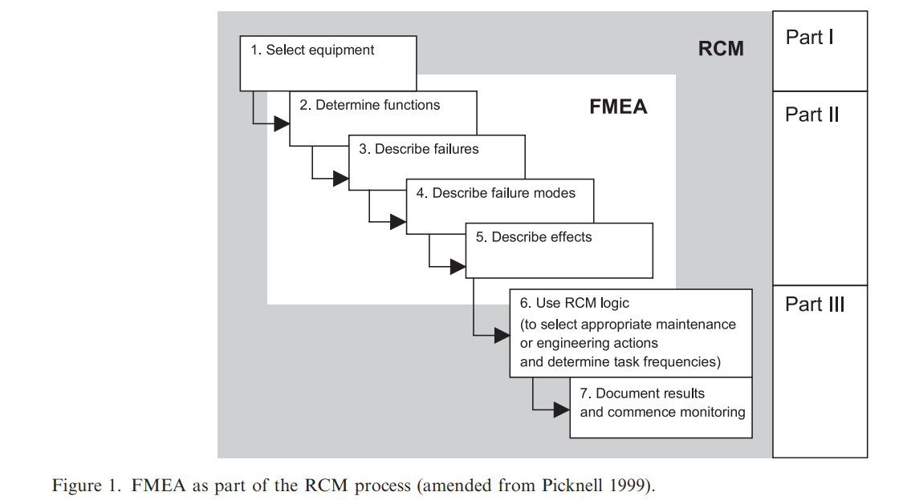
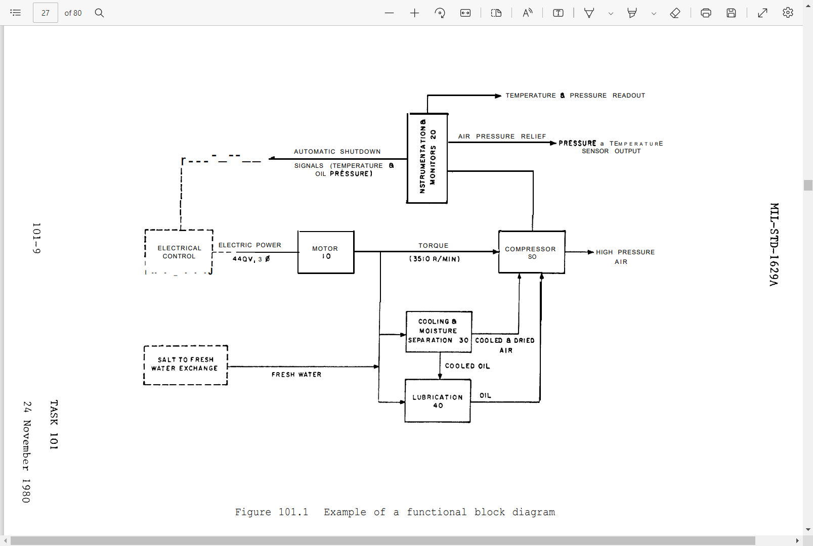
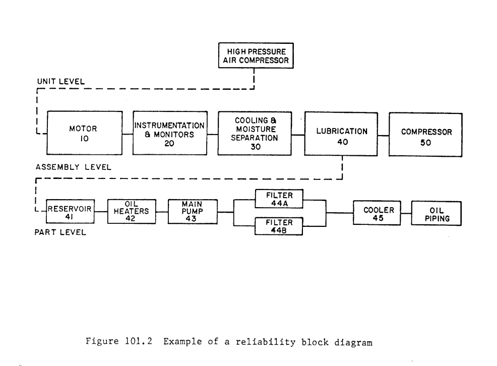

# RCM/FMEA process
Reliability-centred maintenance (RCM) and failure mode and effects analysis (FMEA) are important methods for defining preventive maintenance programmes

- FMEA is used to identify failure modes.
- FMEA is a method of reliability analysis intended to identify failures affecting the functioning of a system and enable priorities for action to be set.

 

- Failure modes are the ways, or modes, in which an asset can fail.
- The __severity__, __probability of occurrence__ and __risk of non-detection__ are estimated and used to rate the risk associated with each failure mode. Usual practice is to combine these elements in a __‘risk priority number’__

Failure modes can be classified into three categories: 
- when the capability falls below the desired performance
- when the desired performance rises above initial capability
- when the asset is not capable of doing what is
wanted from the outset

**Indenture levels** The item levels which,identify or
describe relative complexity of assembly or function. The levels progress from the more complex (system) to the simpler (part) divisions.

---

- CBM - condition based maintenance
- MO - Maintenance organization
- MP - maintenance policies

A **maintenance policy** defines the way how a trigger, 
such as time, load, inspection, failure or predictive CBM technology leads to action, which can be corrective, preventive, opportunistic, condition-based or predictive in nature

---

## RCM Process
The RCM process is a qualitative method consisting of answering seven questions, which are registered in an overview called a Failure Modes and Effects Analysis (FMEA)
1) What are the functions and associated 
performance standards of the asset in its present operating context? 
2) In what ways does it fail to fulfil its functions? 
3) What causes each functional failure? 
4) What happens  when each failure occurs? 
5) In what way does each failure matter? 
6) What can be done to prevent each failure? 
7) What should be done if a suitable proactive task cannot be found?

The RCM process is performed by a “RCM review group”
- facilitator
- operations supervisor
- operator
- engineering supervisor
- craftsman 
- if needed, an external specialist.

The outcomes of an RCM analysis should result in three outcomes 
- Maintenance schedules
- operating procedures for the operator of the asset
- list for re-design or changed operating procedures that are used when the asset, in its current configuration, 
cannot achieve the desired performance

### Predicting failures
In order to predict the occurrence of a failure, quantitative methods are required. e.g.
- Condition based maintenance (CBM) (Jardine 
et al., 2006), 
- life data analysis & accelerated life testing (Rausand & Høyland, 2004)
- load & usage based maintenance